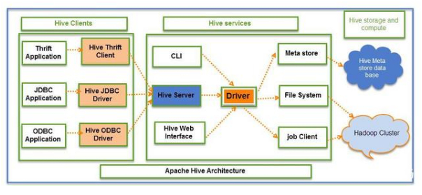
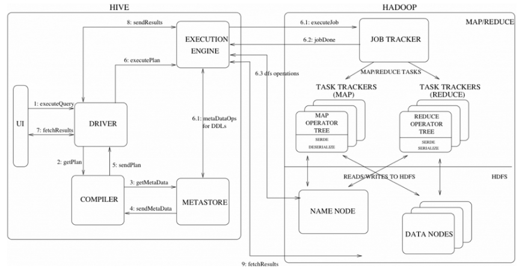

什么是Hive？我们为什么要使用Hive？
Hive的架构以及工作流程是怎样的？
什么是内部表什么是外部表？他们有什么区别？
什么是分区表和分桶表？他们有什么区别？

<!--more-->

#### Hive 简介

#####  什么是Hive?

&emsp;&emsp;hive是由 Facebook 实现并开源的一个基于Hadoop的数据仓库工具，它的底层数据是存储在HDFS上的，它提供了类似SQL的 Hive SQL语言，能够将结构化的数据映射为一张数据库表，其底层原理是将HQL 语言转化为MapReduce 任务执行，从而完成对Hadoop集群中存储的海量数据进行查询和分析。

#####  为什么使用Hive?

&emsp;&emsp;hive提供了类SQL的语法，避免了写实现复杂逻辑的MapReduce程序，从而降低了开发人员的学习成本，提高开发人员快速开发的能力，并且hive还具有更好的扩展性，可以自由扩展集群规模而无需重启服务，还支持用户自定义函数。

#####  Hive的优缺点

优点：

- 简单易上手：提供了类SQL查询语言HQL
- 可扩展：Hive可以自由的扩展集群的规模，一般情况下不需要重启服务就可以进行扩展
- 提供了同一的元数据管理
- 延展性：Hive支持自定义函数，用户可以根据自己的需求来实现自己的函数
- 容错性：良好的容错性，结点出现故障，SQL语句仍可以完成执行

缺点：

- Hive延时严重：启动MapReduce Job时有延迟
- Hive不支持记录级别的增删改操作，但是用户可以通过查询生成新表或者将查询结果导入到文件中
- Hive不支持事务：主要用来做OLAP(联机分析处理)，而不适用OLTP（联机事务处理）

#####  Hive 与RDBMS 的对比

- Hive使用HDFS存储数据，而关系型数据库则是存储在服务器本地的文件系统中；
- Hive使用MapReduce作为计算模型，而关系型数据库则是使用自己设计的计算模型
- Hive实时性差它是为海量数据做数据挖掘设计的；而关系型数据库实时性好，它是为实时查询的业务进行设计的
- Hive扩展性强，可以很容易的扩展自己的存储能力和计算能力，而关系型数据库在这方面相对较差
- Hive不支持对某个具体行的操作，对数据的操作只支持覆盖原数据和追加数据；而关系型数据库支持对行级的更新删除
- Hive是"读时模式"，即在加载数据的时候不会对数据进行检查/更改，在查询操作时才会检查数据的格式；而关系型数据库是"写时模式"，在数据加载的时候就会对数据模式进行检查校验的操作。
- Hive延迟较高，因为Hive不支持索引，所以查询的时候会扫描整个表，而且Hive在启动MapReduce Job的时候也会造成较大的延迟；而关系型数据库支持复杂索引，所以延迟相对较小

#####  Hive 架构

######  Hive架构设计

Hive架构设计主要包括三个部分：

- Hive Clients：Hive客户端，它为不同类型的应用程序提供不同的驱动，使得Hive可以通过类似Java、Python等语言连接，同时也提供了JDBC和ODBC驱动。 

- Hive Services：Hive服务端，客户端必须通过服务端与Hive交互，主要包括：  
&emsp;&emsp;用户接口组件（CLI，HiveServer，HWI），它们分别以命令行、与web的形式连接Hive。             
&emsp;&emsp;Driver组件，该组件包含编译器、优化器和执行引擎，它的作用是将hiveSQL语句进行解析、编译优化、生成执行计划，然后调用底层MR计算框架。    
&emsp;&emsp;Metastore组件，元数据服务组件。Hive数据分为两个部分，一部分真实数据保存在HDFS中，另一部分是真实数据的元数据，一般保存在MySQL中，元数据保存了真实数据的很多信息，是对真实数据的描述。

- Hive Storage and Computing:包括元数据存储数据库和Hadoop集群。Hive元数据存储在RDBMS中，Hive数据存储在HDFS中，查询由MR完成。

######  Hive各组件说明

- thrift server：跨语言服务提供了一种能力，让用户可以使用多种不同的语言来操纵hive

- 用户接口: shell/CLI, jdbc/odbc, webui Command Line Interface
    - CLI，Shell 终端命令行（Command Line Interface），采用交互形式使用 Hive 命令行与 Hive 进行交互，最常用（学习，调试，生产）
    - JDBC/ODBC，是Hive基于JDBC操作提供的客户端，用户（开发员，运维人员）通过这连接至 Hive server 服务
    - Web UI，通过浏览器访问 Hive

- 驱动器Driver：它是Hive的核心,主要完成HQL查询语句从词法分析，语法分析，编译，优化，以及逻辑执行计划的生成。生成的逻辑执行计划存储在HDFS中，并随后由MapReduce调用执行。

&emsp;&emsp;Driver驱动引擎由四部分组成：   

&emsp;&emsp;&emsp;&emsp;解释器：解释器的作用是将HiveSQL语句转换为抽象语法树（AST）  
&emsp;&emsp;&emsp;&emsp;编译器Compiler：编译器是将语法树编译为逻辑执行计划    
&emsp;&emsp;&emsp;&emsp;优化器Optimizer：优化器是对逻辑执行计划进行优化  
&emsp;&emsp;&emsp;&emsp;执行器Executor：执行器是调用底层的运行框架执行逻辑执行计划

- 元数据存储系统RDBMS MySQL：存储在 Hive 中的数据的描述信息
    - Hive 中的元数据通常包括：表的名字，表的列和分区及其属性，表的属性（内部表和外部表），表的数据所在目录等
    
    - Metastore 默认存在自带的Derby数据库中。缺点就是不适合多用户操作，数据存储目录不固定。数据库跟着Hive走，极度不方便管理。因此建议存储在关系型数据库中

######  Hive 具体工作流程

- 1）用户通过用户接口提交查询任务给Driver。  
- 2）Driver获得该用户的计划，调用编译器检查查询语法并分析查询计划和要求。 
- 3）编译器Compiler根据用户任务到MetaStore中请求需要的Hive的元数据信息。
- 4）Metastore发送元数据信息给编译器
- 5）编译器对任务进行编译，先将HiveQL转换为抽象语法树，然后将抽象语法树转换成查询块，将查询块转化为逻辑的查询计划，重写逻辑查询计划，将逻辑计划转化为物理的计划（MapReduce）,最后选择最佳的策略。并将计划提交给Driver。
- 6）Driver将计划转交给执行引擎ExecutionEngine去执行
- 7）执行引擎发送作业给JobTracker，执行引擎获取元数据信息（这是在名称节点），并把它分配作业到TaskTracker（这是在数据节点），在这里查询执行MapReduce工作。与此同时，在执行时，执行引擎可以通过Metastore执行元数据操作（虚线部分）。
- 8）执行引擎接收来自数据节点的执行结果。  
- 9）执行引擎发送这些结果给驱动程序。
- 10）驱动程序将结果发送给Hive接口（返回给用户）

##### Hive 中的数据模型：

- database：在 HDFS中表现为${hive.metastore.warehouse.dir}目录下一个文件夹
- table：在 HDFS 中表现所属 database 目录下一个文件夹
- external table：与 table 类似，不过其数据存放位置可以指定任意 HDFS 目录路径
- partition：在 HDFS 中表现为 table 目录下的子目录
- bucket：在 HDFS 中表现为同一个表目录或者分区目录下根据某个字段的值进行 hash 散列之后的多个文件
- view：与传统数据库类似，只读，基于基本表创建

##### Hive 中的内部表、外部表

###### 什么是内部表和外部表
- hive有两种类型的表：内部表、外部表
- 如果在创建表的时候没有指明是内部表还是外部表，则默认是内部表

###### 内部表和外部表的区别：

内部表：
- 内部表的数据会放在hdfs中的特定位置中，通常是/user/hive/warehouse
- 当使用drop table table_name;删除内部表时，数据文件也会一并删除

外部表：
- 外部表的数据的可以存放在 hdfs任意路径下
- 当使用drop table table_name;删除外部表时，只是删除了表的元数据，它的数据并没有被删除

###### 内部表和外部表的使用场景

内部表：
- 适用于临时创建的中间表。
- 如果数据的所有处理都在 Hive 中进行，那么倾向于选择内部表。

外部表：
- 适用于数据多部门共享。
- 如果 Hive 和其他工具要针对相同的数据集进行处理，外部表更合适。使用外部表访问存储在 HDFS 上的初始数据，然后通过 Hive 转换数据并存到内部表中。

##### Hive中的分区表和分桶表

###### 为什么要进行分区和分桶

分区：
- 分区的最大好处就是可以更快的执行查询。
- 在分区的帮助下，将使用分区列的名称创建一个子目录，并且当使用where子句执行查询时，将只扫描特定的子目录，而不是扫描整个表。能够更快地执行查询。

分桶：
- 分桶表是一种更细粒度的数据分配方式，一个表既可以分区也可以分桶。
- 对表进行分桶操作有利于实现数据的抽样，方便进行数据测试

###### 分区表和分桶表的区别

- 分区: 是以字段的形式在表结构中存在，通过describe table命令可以查看到字段存在， 但是该字段不存放实际的数据内容，仅仅是分区的表示（伪列）。

- 分桶:对于表（table）或者分区， Hive可以进一步组织成桶，也就是说桶是更为细粒度的数据范围划分。Hive也是 针对某一列进行桶的组织。Hive采用对列值哈希，然后除以桶的个数求余的方式决定该条记录存放在哪个桶当中。实际使用比较少。